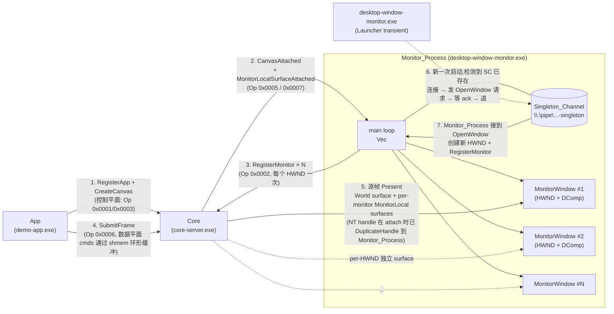
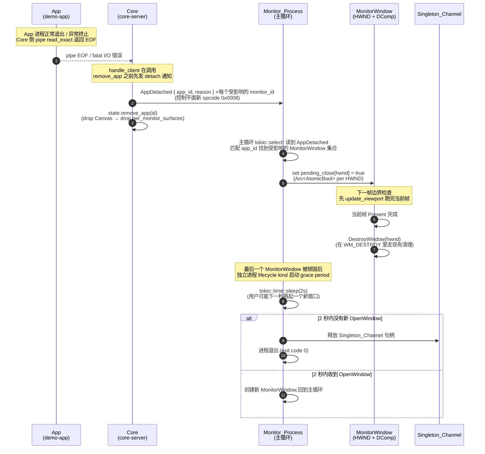

# Canvas-Monitor Lifecycle — Design

## Overview

本 spec 一次性收口 `hotfix-visible-render` 端到端验证之后用户反馈的三件事,全都落在同一层抽象("App / Core / Monitor 三层协议与 lifecycle"):

1. **命名统一**:把协议符号 / IPC 内部结构 / `server_task.rs` 的局部变量与日志文案里残留的 "producer" / "consumer" 术语全部迁到 "app" / "monitor",让源码与 `animation-and-viewport-fix` 之后确立的对外术语一致。
2. **App-Monitor 生命周期联动**:App 断 pipe 时 Core 主动通知所有 attach 到其 Canvas 的 Monitor,让独立进程型 Monitor 跟着清退,避免残留 `desktop-window-monitor.exe`。
3. **Monitor 单实例 + 多窗口**:同一台机器同一时刻最多一个 `desktop-window-monitor` 后台进程,再次启动等价于"开一个新窗口"。

这三件事在 requirements 阶段各自配了一个 Requirement(Req 1 / Req 2 / Req 3),并留了 5 个开放决策。用户已在 requirements 阶段把 5 个开放决策全部锁到推荐项:

| 决策 | 选项 | 本 spec 的执行含义 |
|---|---|---|
| **D1** | A — 推迟 FPS 数字 | 本 spec 不动 painter ABI、不加 `CMD_DRAW_TEXT`、不引入 DirectWrite。`demo-app.rs` 里 FPS 继续是颜色方块。文字渲染推给后续 `text-rendering` spec。 |
| **D2** | A — 新增 `AppDetached` 控制消息 | Core 在清理 App 之前,向受影响的每个 Monitor 发一条明确的 `AppDetached`。Monitor 收到 → 清退;纯 pipe EOF(无前导通知)→ 重连。新增 opcode **`0x0008`**(下文 §Data Models 锁字节布局)。 |
| **D3** | A — Monitor bin 自决 lifecycle kind | 协议不区分 Standalone / Hosted,`RegisterMonitor` 的线上字节与 `RegisterConsumer` 完全一致(只有 4 字节 pid),PE-6 / PE-7 不破。`desktop-window-monitor` 硬编码 `MonitorLifecycleKind::Standalone` → "收到 AppDetached 后 2 秒内退进程";Game Bar widget 后续接入时硬编码 `Hosted`。 |
| **D4** | A — Named Pipe 兼做单实例门卫 + 指令通道 | Singleton_Channel pipe 名 `\\.\pipe\overlay-desktop-window-monitor-singleton`;用 tokio `ServerOptions::first_pipe_instance(true)` 保证原子性;第二次启动尝试 connect:成功 → Launcher 角色,发 `OpenWindow` + 等 ack + 退;失败且 pipe 不存在 → 自己成为后台进程。 |
| **D5** | A(N 个 monitor_id, 一个进程) + E1(Game Bar widget 本 spec 不动) | Monitor_Process 对每个 HWND 都走一次 `RegisterMonitor` + auto-attach;Core 侧 `per_monitor_surfaces` 的键仍是 `monitor_id`。`monitors/game-bar-widget/` 目录字节不动,PE-10 保留;Game Bar widget 接入新 lifecycle 协议留给后续 spec。 |

**本 spec 的边界(scope negatives,对应 Req 5)**:

- 不引入文字渲染(D1);`demo-app.rs` 里的 FPS 条仍是 `FILL_RECT` 颜色方块。
- 不引入输入事件(鼠标 / 键盘 / 触摸)协议。
- 不改 `painter-abi-v1.0` / `painter-abi-v0.7` 文档以外的渲染协议,不引入新 painter ABI 版本。
- 不改 `CanvasResources` / `PerMonitorResources`(重命名后)的 buffer count / acquire / present 策略 —— 这些是 `animation-and-viewport-fix` 锁下的。
- 不动 `monitors/game-bar-widget/` 目录(D5/E1),PE-10 保留。
- 不把 `demo-consumer.rs` 重命名、不重写 `log.rs`、不拆 `core-server/src/bin/server.rs` 主函数 —— 这些"顺便"诱惑留给独立 spec。

**Requirements 文档策略**:requirements.md 的"开放决策"章节本来用于记录 5 个决策**未锁定**时的选项。按照用户指示,requirements.md 保持不变(保留历史价值);本 design 文档的这张决策表就是决策落地的证据。

## Architecture

本 spec 的架构改动全部落在控制平面(协议 + 生命周期),数据平面(`SubmitFrame` 的 D3D11 / DComp 路径)byte-for-byte 不变。下面两张 mermaid 图分别刻画稳态流和 App 关闭时序。

### Steady-state 控制/数据平面

单 App + 一个 Monitor_Process(内含 N 个 Monitor_Window)稳态下,协议与今天等价,只是命名统一成 App / Monitor,并且 Monitor_Process 持有一条 Singleton_Channel 以便后来者把"开新窗口"请求转发进来。



说明:

- 协议层仍然是一个 Monitor_Window ↔ 一个 `monitor_id`(决策 D5 = A)。稳态下 N 个 HWND 就是 N 条 Named Pipe 连接 + N 个 `monitor_id`。`per_monitor_surfaces`(`per_consumer_surfaces` 重命名后)的独立性和今天完全一致。
- Singleton_Channel 是 Monitor_Process 内部的第二条 pipe,**不**与 Core 的 `\\.\pipe\overlay-core` 共享命名空间,也**不**走 `ControlMessage` 协议(见下文 §Data Models)。
- 数据平面的 shmem 环形缓冲、Present 握手、`PUSH_SPACE(MonitorLocal)` 命令空间栈逻辑全部沿用 `animation-and-viewport-fix` + `hotfix-visible-render` 留下的实现,本 spec 不动。

### App 关闭时序(Req 2 联动路径)

下面这张图刻画 D2 = A 决策下的 detach 通知 + 帧边界清 shutdown + 独立进程 lifecycle kind 的退进程路径。Transient_Pipe_Error(纯 pipe EOF 无前导通知)走重连,**不**走这条路径。



说明:

- Step 3 发生在 Core 的 `handle_client` 里,**在** `state.remove_app(id)` **之前**,这样 `state` 读锁仍能遍历 `apps[id].canvas_ids` → `canvases[cid].per_monitor_surfaces.keys()` 拿到 `monitor_id` 集合,再通过 `monitors[mid].tx`(`UnboundedSender<ControlMessage>`)把消息挤进每个 Monitor 的 writer 任务。
- Step 4 的 drop 链在今天的 `remove_producer` 已经 battle-tested(丢弃 `Canvas` → 丢弃 `per_consumer_surfaces` HashMap → 丢弃每个 `PerConsumerResources` → 释放 COM + NT handle)。本 spec 只在它之前加一步"广播 AppDetached",drop 链不动。
- Step 7 的"帧边界清 shutdown"对应 Req 2 AC 10:用 `Arc<AtomicBool>` 做一拍延迟,保证当前帧的 DComp 资源不会在 Present 未完成时就被 DestroyWindow 连带释放。
- Step 9 的 2 秒 grace period:独立进程 lifecycle kind 的硬编码策略。Grace period 的设计理由是"用户可能下一秒再开个新窗口",这种情况下重启整个进程 + 重连 Core 代价不小,宁可多等 2 秒。

## Components and Interfaces

本段按 Change-A..E 5 组改动列出所有接口表面与文件变更。每一组都说明**动什么**、**不动什么**、以及对应的 preservation 守界。

### Change-A — 协议变更(新增 `AppDetached` opcode + 符号重命名)

#### A1. 符号重命名(线上字节不变)

| 旧 | 新 | 备注 |
|---|---|---|
| `OP_REGISTER_PRODUCER`(`0x0001`) | `OP_REGISTER_APP` | 数值不变 |
| `OP_REGISTER_CONSUMER`(`0x0002`) | `OP_REGISTER_MONITOR` | 数值不变 |
| `OP_ATTACH_CONSUMER`(`0x0004`) | `OP_ATTACH_MONITOR` | 数值不变 |
| `OP_CREATE_CANVAS`(`0x0003`) | `OP_CREATE_CANVAS` | 不改名 |
| `OP_CANVAS_ATTACHED`(`0x0005`) | `OP_CANVAS_ATTACHED` | 不改名 |
| `OP_SUBMIT_FRAME`(`0x0006`) | `OP_SUBMIT_FRAME` | 不改名 |
| `OP_MONITOR_LOCAL_SURFACE_ATTACHED`(`0x0007`) | `OP_MONITOR_LOCAL_SURFACE_ATTACHED` | 不改名;"Monitor" 这里指 MonitorLocal 空间,跟本 spec 术语 monitor 正好对齐 |
| `ControlMessage::RegisterProducer { pid }` | `ControlMessage::RegisterApp { pid }` | payload 字节不变(4 B LE `pid`) |
| `ControlMessage::RegisterConsumer { pid }` | `ControlMessage::RegisterMonitor { pid }` | payload 字节不变(4 B LE `pid`) |
| `ControlMessage::AttachConsumer { canvas_id, consumer_id }` | `ControlMessage::AttachMonitor { canvas_id, monitor_id }` | payload 字节不变(8 B:2× LE u32),字段只改 Rust 名 |
| `ControlMessage::MonitorLocalSurfaceAttached { .., consumer_id, .. }` | `ControlMessage::MonitorLocalSurfaceAttached { .., monitor_id, .. }` | 变体名不改(Req 1 AC 2),字段 `consumer_id` → `monitor_id` |

对 `encode` / `decode` / `opcode` 方法的改动限定在 match arms 的变体名重写与结构体解构的 field 名重写,产出字节完全不变。

#### A2. 新增 `AppDetached` opcode

| 属性 | 值 |
|---|---|
| Opcode 常量 | `pub const OP_APP_DETACHED: u16 = 0x0008;` |
| 变体 | `ControlMessage::AppDetached { app_id: u32, reason: u8 }` |
| payload 长度 | 5 字节 |
| 字节布局(全 little-endian) | `u32 app_id` (4 B) + `u8 reason` (1 B) |
| Preservation | `control_plane_bytes.bin` **append** 一条新样本,`0x0001..=0x0006` / `0x0007` 的原有字节不变;见 §Testing Strategy。 |

`reason` 枚举值(Rust 侧用 `#[repr(u8)]` enum 内部表示,线上仅 1 字节):

```rust
#[repr(u8)]
pub enum AppDetachReason {
    GracefulExit = 0, // App 有序退出、pipe EOF 未伴随 I/O 错误
    IoError     = 1,  // pipe read/write 返回 fatal 错误(非 EOF)
    Other       = 2,  // 其他(state.remove_app 被外部强制触发,今天没有此路径)
}
```

选择最小 3 值集合的理由:Monitor 今天在收到 `AppDetached` 时的唯一动作是"清退受影响的 MonitorWindow",不会根据 reason 做分支决策;`reason` 更多是给 Core / Monitor 的日志留一条事件分类(运维可 grep)。未来若 Monitor 需要区分"App 崩溃"和"App 正常退出"展示不同 UI 文本,现有 1 字节字段已足够扩展到 256 种。

**字节样本**(oracle 追加):`app_id = 0x00000042`, `reason = 1` →

```
header: 4C 52 56 4F  01 00  08 00  05 00 00 00
                     ^vers  ^op    ^payload_len
payload: 42 00 00 00  01
```

(12 字节 header + 5 字节 payload = 17 字节)

这条样本追加到 `control_plane_bytes.bin` 的末尾;现有文件前缀字节不变。oracle 的 append 与 PBT A 的 "capture-or-verify" 语义兼容 —— 新样本在首次运行重新 capture 一次,之后的运行 byte-identical 校验。

#### A3. 解码器对 `AppDetached` 的行为

在 `ControlMessage::decode` 的 match 里追加一条 arm:

```rust
OP_APP_DETACHED => {
    if buf.remaining() < 5 {
        return Err(ProtocolError::BufferTooSmall {
            expected: 5,
            actual: buf.remaining(),
        });
    }
    Ok(Some(Self::AppDetached {
        app_id: buf.get_u32_le(),
        reason: buf.get_u8(),
    }))
}
```

unknown-opcode 降级路径**不需要改** —— 它已经在 `hotfix-visible-render` task 3.3 做成了 "skip payload + warn"。任何老版本 Monitor 即使没更新也会正确 skip 新消息,不会 crash。

### Change-B — Rust 符号重命名

按 Req 1 AC 5/6/7 列出完整映射表。工作流建议:**用 `semanticRename` 逐个跑**(每改一个符号 `cargo check --workspace` 一次)。**不要** `sed` 全局替换 —— comment 或文档里的 "producer"(自然语义,如"producer draws to the canvas")若被误改会污染注释。

#### B1. `core-server/src/ipc/server.rs`

| 旧 | 新 | 种类 |
|---|---|---|
| `struct Producer` | `struct App` | struct |
| `struct Consumer` | `struct Monitor` | struct |
| `Canvas::per_consumer_surfaces` | `Canvas::per_monitor_surfaces` | field |
| `Producer::canvases: Vec<u32>` | `App::canvas_ids: Vec<u32>`(重命名并借此明确语义;值不变) | field |
| `ServerState::producers: HashMap<u32, Producer>` | `ServerState::apps: HashMap<u32, App>` | field |
| `ServerState::consumers: HashMap<u32, Consumer>` | `ServerState::monitors: HashMap<u32, Monitor>` | field |
| `ServerState::next_producer_id` | `ServerState::next_app_id` | field |
| `ServerState::next_consumer_id` | `ServerState::next_monitor_id` | field |
| `fn register_producer` | `fn register_app` | method |
| `fn register_consumer` | `fn register_monitor` | method |
| `fn remove_producer` | `fn remove_app` | method |
| `fn remove_consumer` | `fn remove_monitor` | method |
| `fn attach_consumer` | `fn attach_monitor` | method |
| parameter `consumer_id` in methods | `monitor_id` | param |

**增补字段**(为 Req 2 AC 1 的 detach broadcast 提供反向索引):

`Canvas` 结构体当前没有 `owner_app_id` 字段(只有 `owner_pid: u32`)。为了在 `handle_client` 的 App 断开路径上**不经第二次 HashMap 查找**直接拿到 "该 App 所拥有的全部 Canvas",本 spec **不新增** `Canvas::app_id` 字段,而是复用现有的 `App::canvas_ids: Vec<u32>`(原 `Producer::canvases`)。选这条路径的理由:

- `App::canvas_ids` 今天就存在(`remove_producer` 的实现已经在遍历它),增补零字段。
- 反向查找一步到位:`state.apps[&app_id].canvas_ids` → 每个 `canvas_id` → `state.canvases[&cid].per_monitor_surfaces.keys()` → 每个 `monitor_id` → `state.monitors[&mid].tx`。读锁一把覆盖。
- 若未来需要 Canvas 级 orphan 检测(一个 Canvas 的 owner 消失但 Canvas 本身需要保留),再加 `Canvas::owner_app_id: u32` 作为独立字段,不受本 spec 影响。

#### B2. `core-server/src/renderer/dcomp.rs`

| 旧 | 新 |
|---|---|
| `struct PerConsumerResources` | `struct PerMonitorResources` |
| `PER_CONSUMER_MAX_DIM` const | `PER_MONITOR_MAX_DIM` |
| `PER_CONSUMER_MIN_DIM` const | `PER_MONITOR_MIN_DIM` |
| 所有 `consumer_id` 参数 | `monitor_id` |
| 日志前缀 `[PerConsumerResources]` | `[PerMonitorResources]` |

#### B3. `core-server/src/server_task.rs`

| 旧 | 新 | 位置 |
|---|---|---|
| local var `producer_id` | `app_id` | `SubmitFrame` 分支 |
| local var `is_producer` | `is_app` | `client_id: Option<(u32, bool)>` |
| local var `consumer_id` | `monitor_id` | `AttachConsumer` → `AttachMonitor` 分支 |
| log `"Registered Producer with ID: {} (PID: {})"` | `"Registered App with ID: {} (PID: {})"` | `RegisterProducer` arm |
| log `"Registered Consumer with ID: {} (PID: {})"` | `"Registered Monitor with ID: {} (PID: {})"` | `RegisterConsumer` arm |
| log `"Cleaning up Producer {}"` | `"Cleaning up App {}"` | disconnect cleanup |
| log `"Cleaning up Consumer {}"` | `"Cleaning up Monitor {}"` | disconnect cleanup |
| log `"AttachConsumer received but client is not a registered producer"` | `"AttachMonitor received but client is not a registered app"` | `AttachConsumer` arm |
| log `"CreateCanvas received but client is not a registered producer"` | `"CreateCanvas received but client is not a registered app"` | `CreateCanvas` arm |
| log `"CreateCanvas created ID {} for Producer {}"` | `"CreateCanvas created ID {} for App {}"` | `CreateCanvas` arm |
| log `"Attached Canvas {} to Consumer {}"` | `"Attached Canvas {} to Monitor {}"` | `AttachConsumer` arm |
| log `"AttachConsumer error: {}"` | `"AttachMonitor error: {}"` | `AttachConsumer` arm |

每条日志的 `{}` 占位符数量与顺序与原版一致(Req 1 AC 7 的硬约束)。

#### B4. 不改的符号(刻意保留,对应 Req 1 AC 9 + Req 4 AC 12)

- `ControlMessage::MonitorLocalSurfaceAttached` 的变体名保留(其中 "Monitor" 指 MonitorLocal 空间)。
- `monitors/desktop-window/src/bin/monitor.rs`(下文 Change-C smartRelocate 后)里的窗口类名 `"OverlayDesktopMonitor"` 与标题字符串 `"Desktop Monitor - ..."` 保持不变 —— 这些已经是 "monitor" 新命名,改了反而破 `hotfix-visible-render` Change-B 的 `format_window_title` 行为。
- `desktop_window::title::AttachState` / `format_window_title` / 其单元测试集全部保留不改。
- `core-server/src/bin/demo-consumer.rs` 保留不动(Req 5 AC 6;它是早期 smoke test 二进制,未来若需重命名到 `demo-monitor` 走独立 spec)。

### Change-C — Spike 清理 + Monitor bin 文件搬家

`monitors/desktop-window/` 里残留着 spike 阶段的三个文件与一个 `[[bin]]` 条目。它们全部被 `core-server/src/ipc/` 取代,本 spec 一次性清掉。

#### C1. 删除文件

```text
monitors/desktop-window/src/dcomp.rs      ← spike 独立 DComp 初始化,已被 core-server 取代
monitors/desktop-window/src/proto.rs      ← spike 独立 protocol,已被 core-server::ipc 取代
monitors/desktop-window/src/bin/producer.rs ← spike 阶段的 demo producer,被 core-server/src/bin/demo-app.rs 取代
```

#### C2. `monitors/desktop-window/src/lib.rs` 缩减

- 删除 `pub mod dcomp;` 与 `pub mod proto;` 行。
- 保留 `pub mod title;`(`format_window_title` / `AttachState` 被 `bin/monitor.rs` 使用,且有独立单元测试)。
- 保留文件头 spike doc 注释(它仍然描述 crate 的职责)或者把注释更新到当前角色 —— 选其一,**由 tasks 阶段判断**,但文件本身必须继续存在。
- 现有的 `PIPE_PATH` / `handle_to_u64` / `u64_to_handle` helper 被 spike 用过,新 bin 是否仍引用它们,tasks 阶段 `cargo check` 告诉你;不被引用就一并删,被引用就保留。

#### C3. `monitors/desktop-window/Cargo.toml`

- 删除整段:

  ```toml
  # TODO(canvas-monitor-lifecycle rename spec): rename desktop-demo-producer -> desktop-demo-app
  [[bin]]
  name = "desktop-demo-producer"
  path = "src/bin/producer.rs"
  ```

  (连同 TODO 注释一起删除 —— 这条 TODO 就是指向本 spec 的,现在被消化。)

- `[[bin]].path` 从 `"src/bin/consumer.rs"` 改为 `"src/bin/monitor.rs"`:

  ```toml
  [[bin]]
  name = "desktop-window-monitor"
  path = "src/bin/monitor.rs"
  ```

  `name` 保持 `"desktop-window-monitor"` 不变,这样 `cargo run -p desktop-window-monitor --bin desktop-window-monitor` 命令行 byte-identical,`END-TO-END-TESTING.md` 里的命令不破。

#### C4. 文件搬家

- `monitors/desktop-window/src/bin/consumer.rs` → `monitors/desktop-window/src/bin/monitor.rs`
  使用 `smartRelocate` 工具(自动更新所有 import / path 引用)。文件内**内容不改**(窗口类名 / 标题字符串 / `AttachState` 引用 / `println!` 的 `[desktop-monitor]` 前缀 —— 都已是 monitor 新命名)。
- `core-server/src/bin/demo-producer.rs` 在 `hotfix-visible-render` 已经搬到 `core-server/src/bin/demo-app.rs`,本 spec 无须再动。
- `monitors/desktop-window/README.md` 所有用户可见的 "producer" / "consumer" 术语替换为 "app" / "monitor",并删除 spike 期 `desktop-demo-producer` 运行指令。
- `END-TO-END-TESTING.md` 把散文里的 "producer" / "consumer" 替换为 "app" / "monitor",保持所有 `cargo run ...` 命令行字节不变(因为用户侧 bin 名 `demo-app` / `desktop-window-monitor` 在 `hotfix-visible-render` 就已稳定)。

### Change-D — App-Monitor 生命周期联动

#### D1. Core 侧:detach 通知广播

在 `core-server/src/server_task.rs::handle_client` 的 disconnect cleanup 路径(原 `if bytes_read == 0 { break; }` 之后、`remove_producer(id)` 之前)插入 detach 广播:

```rust
// Cleanup on disconnect
if let Some((id, is_app)) = client_id {
    let mut state = crate::ipc::server::SERVER_STATE.write();
    if is_app {
        // Change-D1: broadcast AppDetached to every Monitor that has a
        // per-monitor surface on one of this App's canvases BEFORE we drop
        // `apps[id]` / `canvases` / `per_monitor_surfaces`. This is the
        // only path at which Monitors can distinguish "App left" from
        // "transient pipe error" (design.md §Architecture → App 关闭时序).
        let reason = AppDetachReason::GracefulExit; // or IoError based on the
                                                    // `break` cause tracked above
        if let Some(app) = state.apps.get(&id) {
            for cid in &app.canvas_ids {
                if let Some(canvas) = state.canvases.get(cid) {
                    for monitor_id in canvas.per_monitor_surfaces.keys() {
                        if let Some(monitor) = state.monitors.get(monitor_id) {
                            let msg = ControlMessage::AppDetached {
                                app_id: id,
                                reason: reason as u8,
                            };
                            // Req 2 AC 9: send failure must not block cleanup.
                            if let Err(e) = monitor.tx.send(msg) {
                                eprintln!(
                                    "[server_task] AppDetached app={} monitor={} \
                                     send failed: {} — continuing cleanup",
                                    id, monitor_id, e
                                );
                            }
                        }
                    }
                }
            }
        }
        println!("Cleaning up App {}", id);
        state.remove_app(id);
    } else {
        println!("Cleaning up Monitor {}", id);
        state.remove_monitor(id);
    }
}
```

关键设计点:

- **读 HashMap 的顺序**:按 `app → canvas_ids → canvas.per_monitor_surfaces.keys() → monitors` 走。一次 `write()` 锁就够(`remove_app` 也要写,合并成一把锁比 upgrade 读锁便宜)。
- **tracking `reason`**:在 `handle_client` 的 `read_exact` 循环里加一个局部 `detach_reason: AppDetachReason`,初值 `GracefulExit`;任何 `return Err(e.into())` 之前先把它设为 `IoError`。主循环正常 `break`(`bytes_read == 0`)时保持 `GracefulExit`。
- **AppDetached 是否需要等 Monitor 确认**:不需要。`monitor.tx.send` 走的是 `UnboundedSender`,发完立刻返回。Core 清理不阻塞。Monitor 若写队列异常(pipe 已断),send 返回 `Err`,Core 只打一条 warn(Req 2 AC 9)继续清理 —— 反正 Monitor 已经没法收消息了,它自己的 pipe 也很快会触发 Transient_Pipe_Error。
- **为什么 Canvas 没有 `app_id` 反向字段**:参见 §B1 说明。`apps[id].canvas_ids` 已经是反向索引。

#### D2. Monitor 侧:主循环读控制平面

Monitor 当前的主循环(`monitors/desktop-window/src/bin/monitor.rs`,搬家前是 `consumer.rs`)在收到 `CanvasAttached` + `MonitorLocalSurfaceAttached` 后就进入 Win32 消息泵(`PeekMessageW` 循环),不再读 pipe。这不满足 Req 2 AC 1 / AC 2 —— Monitor 必须继续读 pipe 才能收到 `AppDetached`。

本 spec 把 Monitor_Process 改成 **tokio + Win32 混合主循环**:

```rust
// monitors/desktop-window/src/bin/monitor.rs - 伪代码
#[tokio::main(flavor = "current_thread")]
async fn main() -> anyhow::Result<()> {
    // ... 创建第一个 MonitorWindow + RegisterMonitor,拿到 monitor_id + reader/writer 半连接 ...

    let (mut pipe_reader, _pipe_writer) = tokio::io::split(pipe);
    let mut windows: Vec<MonitorWindow> = vec![initial_window];
    // (D5 决策下 windows 只有 1 个条目,每条目自己持有一条到 Core 的独立 pipe 连接)

    loop {
        tokio::select! {
            // (a) 从 Core 读下一条 ControlMessage
            msg = read_next_control_message(&mut pipe_reader) => {
                match msg {
                    Ok(ControlMessage::AppDetached { app_id, reason: _ }) => {
                        // Req 2 AC 2: 500ms 内销毁所有对应该 app_id 的 MonitorWindow
                        for w in windows.iter() {
                            if w.owner_app_id == Some(app_id) {
                                w.pending_close.store(true, Ordering::SeqCst);
                            }
                        }
                    }
                    Ok(other) => { /* 记录并继续 */ }
                    Err(e) => {
                        // Transient_Pipe_Error (Req 2 AC 5):
                        // 不销毁 MonitorWindow,切 Reconnecting 标题
                        for w in windows.iter() {
                            set_window_title(w.hwnd, AttachState::Reconnecting);
                        }
                        // Req 2 AC 6 退避重连:500ms / 1000ms / 2000ms + jitter
                        // Req 2 AC 7 连续 N=10 次失败 → 走独立进程 lifecycle 清退路径
                        match reconnect_with_backoff(&mut windows).await {
                            Ok(()) => continue,
                            Err(_) => {
                                for w in windows.iter() {
                                    w.pending_close.store(true, Ordering::SeqCst);
                                }
                            }
                        }
                    }
                }
            }

            // (b) Win32 消息泵 tick(非阻塞 PeekMessageW + 受影响窗口的帧处理)
            _ = pump_win32_messages(&mut windows) => {
                // pending_close 检查 + 帧边界销毁在这里跑(见 D3)
                cleanup_pending_close_windows(&mut windows);
                if windows.is_empty() && lifecycle_kind == MonitorLifecycleKind::Standalone {
                    // Req 2 AC 3: 最后一个窗口销毁后 2 秒内退出
                    tokio::time::sleep(Duration::from_secs(2)).await;
                    if windows.is_empty() {
                        break;  // 进程退出
                    }
                }
            }

            // (c) Singleton_Channel 的 OpenWindow 请求(见 Change-E)
            req = accept_singleton_request() => {
                handle_singleton_request(req, &mut windows);
            }
        }
    }
    Ok(())
}
```

说明:

- `tokio::select!` 在 `current_thread` runtime 下是合作式调度,`pump_win32_messages` 做非阻塞 `PeekMessageW(PM_REMOVE)` + tick 一次就 yield,不会阻塞 pipe 读。
- `read_next_control_message` 复用现有 `MessageHeader::decode` + `ControlMessage::decode`。
- D5 = A 决策下每个 `MonitorWindow` 各有一条 pipe 连接 + 独立的 `monitor_id`。本伪代码用单一 `pipe_reader` 是简化示意;实际每个 `MonitorWindow` 都有自己的 reader / writer 半,select 分支数量随窗口数增长。Tasks 阶段采用 `FuturesUnordered<_>` 或 per-window `spawn_local` + `mpsc` 的 fan-in 模式 —— 选一个,理由在 tasks 里给。

#### D3. 帧边界清 shutdown(Req 2 AC 10)

每个 `MonitorWindow` 持有一个 `pending_close: Arc<AtomicBool>`(初始 `false`)。`wnd_proc` 不直接在 `AppDetached` 到达时 `DestroyWindow` —— 这可能和正在执行的 `SubmitFrame → Present` 撞上。

流程:

1. Monitor 主循环(D2)收到 `AppDetached` → 设 `pending_close.store(true)`。
2. `pump_win32_messages` 每 tick 一次,tick 结束后检查所有 `MonitorWindow`:若 `pending_close` 为 true 且 `!in_frame`(没有 Present 在途),执行 `DestroyWindow(hwnd)`。
3. 若当前有 Present 在途(`WM_WINDOWPOSCHANGED → update_viewport → Commit()` 尚未返回),延到下一帧检查 —— 这在实践上就是下一轮主循环 tick。

实现要点:

- `in_frame` 可以是另一个 `Arc<AtomicBool>`,由 `update_viewport` 进入时 set、返回前 unset。最简化实现是**不跟踪 `in_frame`**,因为 DComp 的 present 是同步返回的(`update_viewport` 返回 = Commit 已调用),只要不在 `update_viewport` 中途 `DestroyWindow`,就不会触发 use-after-release。tokio `current_thread` 主循环天然串行化 —— tasks 阶段选更简实现。
- `DestroyWindow` 触发 `WM_DESTROY`,现有 `wnd_proc` 里的 `PostQuitMessage(0)` 路径**不能**在这里触发 —— 那会让整个消息泵退出。改成只清 `MonitorWindow` 本身的 DComp 资源(`ViewportState` 在 `GWLP_USERDATA` 里 drop);主循环的 `cleanup_pending_close_windows` 负责从 `Vec<MonitorWindow>` 里 remove 该条目。
- 此路径不影响 `hotfix-visible-render` Change-D3 的 `dcomp_dev.Commit()`(紧跟 `target.SetRoot(&root)`)—— 新 monitor.rs 的那段代码字节不改(Req 4 AC 13)。

#### D4. 重连退避(Req 2 AC 6/7)

Transient_Pipe_Error 路径的退避序列硬编码:

```rust
const RECONNECT_BACKOFF_MS: &[u64] = &[500, 1000, 2000];
const RECONNECT_MAX_ATTEMPTS: u32 = 10;
```

每次尝试:

1. 抽取下一个 delay = `RECONNECT_BACKOFF_MS[min(attempt, len - 1)]` + 0~200ms 随机 jitter。
2. 尝试 `ClientOptions::new().open(PIPE_NAME)`。成功 → 对每个存活的 `MonitorWindow` 重新发 `RegisterMonitor` + 收 `CanvasAttached` + `MonitorLocalSurfaceAttached` + 更新标题回 `Attached { canvas_id, ml }`。失败 → attempts += 1,continue。
3. `attempts >= RECONNECT_MAX_ATTEMPTS` → Req 2 AC 7 清退路径(标 `pending_close` 全部窗口)。

选 `N = 10` 的理由:`[500, 1000, 2000]` 三档,前 3 次 = 3.5s,之后每次 2s,10 次总上限 ≈ 3.5 + 7 × 2 = 17.5s + jitter。对"Core 正在重启"给了足够宽限,对"Core 已被永久杀掉"不会等太久。选 `< 3` 会在 Core 正常 restart(比如用户 Ctrl+C 再重起)时过早放弃;选 `> 20` 给残留等待变长、体验差。

#### D5. Lifecycle kind 硬编码

`monitors/desktop-window/src/bin/monitor.rs` 顶部:

```rust
use desktop_window::lifecycle::MonitorLifecycleKind;

const MONITOR_LIFECYCLE_KIND: MonitorLifecycleKind = MonitorLifecycleKind::Standalone;
```

`MonitorLifecycleKind` 定义在 `monitors/desktop-window/src/lib.rs`(或新 module `lifecycle.rs`,tasks 决定):

```rust
/// Monitor 进程如何响应"所有 App 都已 detach"的终态:
/// * Standalone — 退进程(最后一个 MonitorWindow 销毁后 2 秒 grace)。
/// * Hosted     — 关窗口但不退进程(把控制交还给宿主 UWP / 桌面 shell)。
///
/// D3 = A 决策:协议不携带此信息,Monitor bin 自决。
#[derive(Debug, Clone, Copy, PartialEq, Eq)]
pub enum MonitorLifecycleKind {
    Standalone,
    Hosted,
}
```

Game Bar widget 后续接入新 lifecycle 协议时,在其 Rust 粘合层设 `const MONITOR_LIFECYCLE_KIND: MonitorLifecycleKind = MonitorLifecycleKind::Hosted;`,并在 Req 2 AC 4 的路径上把"关窗口 + 呈现 waiting UI"替代"退进程"。本 spec 不落地 Game Bar widget 接入。

### Change-E — Monitor 单实例 + 多窗口

#### E1. Singleton_Channel pipe 命名

```rust
pub const SINGLETON_PIPE_NAME: &str =
    r"\\.\pipe\overlay-desktop-window-monitor-singleton";
```

和 Core 的 `\\.\pipe\overlay-core` 共命名前缀 `overlay-*`(方便运维 grep),但路径不同、服务端不同、协议完全独立。

#### E2. 启动流程(伪代码)

```rust
// monitors/desktop-window/src/bin/monitor.rs::main
async fn main() -> anyhow::Result<()> {
    match try_become_singleton().await {
        Ok(singleton_server) => run_as_monitor_process(singleton_server).await,
        Err(TryBecomeErr::AlreadyExists) => run_as_launcher().await,
        Err(TryBecomeErr::Race) => {
            // 两台进程几乎同时启动,都试过一次,这次重试
            tokio::time::sleep(Duration::from_millis(100)).await;
            match try_become_singleton().await {
                Ok(srv) => run_as_monitor_process(srv).await,
                Err(TryBecomeErr::AlreadyExists) => run_as_launcher().await,
                Err(TryBecomeErr::Race) => {
                    eprintln!("double race; giving up");
                    std::process::exit(1);
                }
                Err(TryBecomeErr::StaleHandle) => /* 同下 */
                  run_as_monitor_process(take_over_stale().await?).await,
            }
        }
        Err(TryBecomeErr::StaleHandle) => {
            eprintln!("stale singleton channel detected, taking over");
            run_as_monitor_process(take_over_stale().await?).await
        }
    }
}

async fn try_become_singleton() -> Result<SingletonServer, TryBecomeErr> {
    // 1. 尝试 connect pipe with 1000ms 超时 → 若成功,已有活跃后台 → AlreadyExists
    if try_connect_singleton(Duration::from_millis(1000)).await.is_ok() {
        return Err(TryBecomeErr::AlreadyExists);
    }
    // 2. 尝试 create pipe with first_pipe_instance = true → 若 ERROR_ACCESS_DENIED
    //    说明他进程恰在我们判断后、create 前拿到实例 → Race
    match ServerOptions::new().first_pipe_instance(true).create(SINGLETON_PIPE_NAME) {
        Ok(srv) => Ok(SingletonServer { pipe: srv }),
        Err(e) if is_access_denied(&e) => Err(TryBecomeErr::Race),
        Err(e) if is_pipe_busy(&e) => Err(TryBecomeErr::StaleHandle),
        Err(e) => Err(TryBecomeErr::Io(e)),
    }
}
```

Req 3 AC 3 的 "stale singleton" 检测:connect 在 1000ms 超时内没响应,但 pipe 句柄"存在"(`first_pipe_instance = true` 失败)—— 说明前一个 Monitor_Process 崩溃遗留了 server 端但没有 accept 循环在跑。处理方式:打 `"stale singleton channel detected, taking over"` 到 stderr,带 `first_pipe_instance = false` 再 create 一个新实例(走 OS 的 pipe instance 管理)。

#### E3. Singleton 指令协议

本 spec 选定 **simple opcode-based 二进制协议**(不用 JSON,理由:保持 native 风格,减少一个 serde 依赖;opcode 空间与 Core 控制平面完全隔离,见 §E4):

```text
Singleton request frame:
  +--------+--------+---------------+
  | opcode | len    | payload       |
  | u16 LE | u32 LE | `len` bytes   |
  +--------+--------+---------------+

Singleton response frame: 同上结构

Request opcodes:
  SINGLETON_OP_OPEN_WINDOW = 0x0101
     payload: u32 LE `target_canvas_id` (0 = auto, 任意非零 = 指定 canvas)
     注: D5 = A 决策下新 MonitorWindow 自动 attach 到所有已存在 Canvas,
         target_canvas_id 保留为扩展字段,本 spec 总是传 0。

Response opcodes:
  SINGLETON_OP_ACK = 0x0201
     payload: u32 LE `monitor_process_pid` + u32 LE `new_monitor_id`
  SINGLETON_OP_NACK = 0x0202
     payload: u16 LE `nack_reason_code` + `*` UTF-8 error message bytes
```

完整消息头格式**刻意**和 Core 控制平面不同(没有 MAGIC / VERSION),确保:

- 如果运维误把 Singleton_Channel 请求喂给 Core(理论不可能,路径不同),Core 的 `MessageHeader::decode` 会返回 `InvalidMagic` 并拒绝,不会走 Core 逻辑。
- 反向同理。

#### E4. 协议隔离保证(Req 3 AC 6)

- 两个 opcode 空间**完全不相交**:Core 用 `0x0001..=0x0008`(本 spec 扩到 0x0008),Singleton 用 `0x0101..=0x0202`。即便意外混流也能通过 opcode 数值判断来源。
- `control_plane_bytes.bin` / `control_plane_monitor_local_surface_bytes.bin` 两份 oracle 的**生成代码**只读 Core 侧的 `ControlMessage::encode`。Singleton 协议不经过这条代码路径,不会污染 oracle。
- Singleton 协议的任何字节都不出现在上述两份 oracle 中。

#### E5. Singleton 接收 loop

Monitor_Process 主循环的 `tokio::select!` 第三个分支:

```rust
req = singleton_server.accept_next_request() => {
    match req {
        Ok(SingletonRequest::OpenWindow { target_canvas_id }) => {
            // 1. 在主线程 post 一个 user-defined Win32 message 唤醒消息泵
            //    (因为 HWND 创建必须在主线程,tokio task 只是协调)
            let new_hwnd = create_new_monitor_window()?;
            // 2. 对新 HWND 走 RegisterMonitor + auto-attach 路径
            let (reader, writer, new_monitor_id) =
                register_new_monitor_to_core(&new_hwnd).await?;
            // 3. push 到 windows Vec
            windows.push(MonitorWindow::new(new_hwnd, reader, writer, new_monitor_id));
            // 4. 回送 SINGLETON_OP_ACK { monitor_process_pid, new_monitor_id }
            singleton_server.respond(SingletonResponse::Ack {
                monitor_process_pid: std::process::id(),
                new_monitor_id,
            }).await?;
        }
    }
}
```

Launcher 侧(`run_as_launcher`):

1. 连接 `SINGLETON_PIPE_NAME`。
2. 发 `SINGLETON_OP_OPEN_WINDOW { target_canvas_id: 0 }`。
3. 读应答帧。
4. 打印 `println!("forwarded open-window request to existing monitor-process (pid {}), exiting", pid)`(Req 3 AC 2 指定的**恰好一行**)。
5. `std::process::exit(0)`。

#### E6. `MonitorWindow` struct

今天 `consumer.rs` 把单窗口的全部状态(HWND / DComp target / visual / surface_wrapper / `ml_visual_state` / `ViewportState`)摊在 `main` 的局部变量。本 spec 抽成一个 struct:

```rust
pub struct MonitorWindow {
    pub hwnd: HWND,
    pub monitor_id: u32,           // Core 分配的 u32,1 HWND 1 个(D5 = A)
    pub canvas_id: u32,            // 当前 attach 的 canvas;D5 下一个 MonitorWindow 通常同时 attach 到多 canvas,选一作主用于标题显示
    pub owner_app_id: Option<u32>, // D1 填充 detach 反向索引;初始 None,由后续协议扩展填充(见下文 "关于 owner_app_id 字段的 caveat")
    pub pipe_writer: WriteHalf<NamedPipeClient>,
    pub target: IDCompositionTarget,
    pub world_visual: IDCompositionVisual2,
    pub ml_visual: Option<IDCompositionVisual2>, // 见 hotfix-visible-render Change-D3
    pub viewport: Arc<Mutex<ViewportState>>,
    pub pending_close: Arc<AtomicBool>,
    pub dcomp_dev: IDCompositionDesktopDevice,
}
```

Monitor_Process 的主状态:`Vec<MonitorWindow>`。

**关于 `owner_app_id` 字段的 caveat**:今天 `CanvasAttached` 消息**不带** `app_id`(协议线上字节布局是 `hotfix-visible-render` 里 PE-6 钉死的)。这意味着 Monitor 无法从 `CanvasAttached` 推断 "这个 canvas 的 owner app 是哪个 `app_id`"。本 spec 的设计选择:

- Req 2 AC 2 要求 Monitor 收到 `AppDetached { app_id }` 时只销毁"对应该 app_id 的"窗口。
- **简化策略**:由于 D5 = A 决策下 Monitor_Process 下的每个 MonitorWindow 都 auto-attach 到**所有**现存 Canvas,在"一次只有一个 App"的常见场景下,任何 `AppDetached` 到来都意味着"所有窗口都应该清退"。本 spec 在 `MonitorWindow::owner_app_id` 保持 `None`,Req 2 AC 2 的实现退化为"收到 `AppDetached` → 标所有窗口 `pending_close = true`"。
- **已知限制**:在"多 App 同时注册"场景下(本 spec 范围外),此简化会误清退不相关窗口。要精确区分,未来需要在 `CanvasAttached` 或新增 `CanvasOwnedBy { canvas_id, app_id }` 消息里带 `app_id`。这条扩展留给后续 spec,**不**在本 spec 落地,以守 PE-6 / PE-7。
- 本限制记录在 `MonitorWindow::owner_app_id` 字段的 rustdoc 里,并在 §Testing Strategy 的集成测试 `app_detached_broadcast_hits_all_attached_monitors` 里作为已知约束 pin 下来。

## Data Models

本段汇总本 spec 新增或重命名的所有 data model,以及它们对应的 preservation 影响面。

### 协议层

| Model | 变更 | Preservation |
|---|---|---|
| `ControlMessage::RegisterApp { pid: u32 }` | 变体重命名(从 `RegisterProducer`);payload 4 字节 LE `pid` 不变 | PE-6 守 `0x0001` 字节不变 |
| `ControlMessage::RegisterMonitor { pid: u32 }` | 变体重命名(从 `RegisterConsumer`);payload 4 字节 LE `pid` 不变 | PE-6 守 `0x0002` 字节不变 |
| `ControlMessage::CreateCanvas { logical_w, logical_h, render_w, render_h }` | 无 | PE-6 |
| `ControlMessage::AttachMonitor { canvas_id, monitor_id }` | 变体 / 字段重命名(从 `AttachConsumer`/`consumer_id`);payload 8 字节 LE 不变 | PE-6 守 `0x0004` 字节不变 |
| `ControlMessage::CanvasAttached { .. }` | 无 | PE-6 |
| `ControlMessage::SubmitFrame { .. }` | 无 | PE-6 |
| `ControlMessage::MonitorLocalSurfaceAttached { .., monitor_id, .. }` | 变体名不改;字段 `consumer_id` → `monitor_id`(Req 1 AC 2)| PE-7 守 `0x0007` 字节不变 |
| `ControlMessage::AppDetached { app_id: u32, reason: u8 }` | **新增**;opcode `0x0008`;payload 5 字节(见 §Change-A2) | `control_plane_bytes.bin` **append** 一条样本;现有字节守死 |

### Monitor 进程内部

| Model | 定义位置(post-rename) | 说明 |
|---|---|---|
| `MonitorLifecycleKind` | `monitors/desktop-window/src/lib.rs` 或新 `lifecycle.rs` | 枚举 `{ Standalone, Hosted }`;本 spec 的 `monitor.rs` 硬编码为 `Standalone`。 |
| `MonitorWindow` | `monitors/desktop-window/src/bin/monitor.rs`(可考虑提到 `src/monitor_window.rs`)| 聚合单窗口的 HWND / DComp / pipe / `pending_close` / `owner_app_id`(见 §Change-E6)。 |
| `AppDetachReason` | `core-server/src/ipc/protocol.rs` | `#[repr(u8)]` enum `{ GracefulExit = 0, IoError = 1, Other = 2 }`;Core 侧用枚举,线上 1 字节。 |

### Singleton 协议

| Model | 定义位置(建议) | Byte layout |
|---|---|---|
| `SingletonRequest::OpenWindow { target_canvas_id: u32 }` | `monitors/desktop-window/src/singleton.rs`(新文件) | `u16 LE opcode=0x0101` + `u32 LE len=4` + `u32 LE target_canvas_id` |
| `SingletonResponse::Ack { pid: u32, new_monitor_id: u32 }` | 同上 | `u16 LE opcode=0x0201` + `u32 LE len=8` + `u32 LE pid` + `u32 LE new_monitor_id` |
| `SingletonResponse::Nack { reason: u16, message: String }` | 同上 | `u16 LE opcode=0x0202` + `u32 LE len=2+message_bytes` + `u16 LE reason` + UTF-8 message |
| `SingletonState`(pure) | 同上,专为单元测试抽出 | `{ monitor_process_pid: u32, registered_windows: Vec<MonitorWindowSnapshot> }` |

`SingletonState` 是一个 pure state machine,与真实 Named Pipe 解耦,供 `handle_singleton_request(req: SingletonRequest, state: &mut SingletonState) -> SingletonResponse` 的单元测试使用(§Testing Strategy E8)。

### 保持不变的 Data Model(列出以明确 Preservation 面)

- `MessageHeader { opcode: u16, payload_len: u32 }` —— 字节布局、`MAGIC = 0x4F56524C`、`VERSION = 1` 全部不变。
- `Canvas { id, owner_pid, logical_w, logical_h, resources, per_monitor_surfaces }` —— 仅 `per_consumer_surfaces` 字段重命名为 `per_monitor_surfaces`,HashMap 键仍是 `monitor_id: u32`,值是 `PerMonitorResources`(`PerConsumerResources` 重命名)。
- `PerMonitorResources` 的内部字段(`handle` / `manager` / `surface` / `buffers` / `textures` / `rtvs` / `render_w` / `render_h` / `logical_w` / `logical_h`)字节布局、acquire/present 策略全部不变。
- `CanvasResources` 不动。
- `AttachState { Connecting, Attached { canvas_id, ml }, Reconnecting }` + `format_window_title` 不动。


## Correctness Properties

*A property is a characteristic or behavior that should hold true across all valid executions of a system-essentially, a formal statement about what the system should do. Properties serve as the bridge between human-readable specifications and machine-verifiable correctness guarantees.*

PBT **适用于本 spec 的部分子集**:Rust 符号重命名(Req 1 AC 1/2/5/6/7/8/9/10/11/12/13/14)、文件不动性断言(Req 4 AC 11 / Req 5 AC 2/3/4/6)、日志文案文字对比(Req 1 AC 7)这些**不**适合 PBT —— 它们是静态文件 / 符号存在性断言,用 EXAMPLE 级别单元测试就够。PBT 的适用面落在:

- 协议 encode/decode round-trip(已有 PBT A 的扩展)
- lifecycle 联动的 pure state machine(AppDetached 广播、pending_close 帧边界语义、reconnect 状态机)
- Singleton_Channel 的 pure try_become / request-response 状态机
- 保留既有 PBT D(多 monitor 独立性)作为 preservation 守界

下面 7 条 property 是 §prework reflection 去冗余后的最终集合。

### Property 1: Control-plane round-trip + oracle byte-identity(含 AppDetached 新样本)

*For any* `ControlMessage` `m` 属于变体集合 `{ RegisterApp, RegisterMonitor, CreateCanvas, AttachMonitor, CanvasAttached, SubmitFrame, MonitorLocalSurfaceAttached, AppDetached }`,以下同时成立:

1. `ControlMessage::decode(m.opcode(), header.payload_len, encode(m))` = `Ok(Some(m'))` 且 `m` 与 `m'` 字段逐项相等(round-trip);
2. 对于前 7 个既有变体,`encode(m)` 的字节子集必须 byte-identical 于 `control_plane_bytes.bin` / `control_plane_monitor_local_surface_bytes.bin` 两份 oracle 中对应的历史字节(PE-6 / PE-7);
3. 对于新增的 `AppDetached` 变体,其 `encode` 产出的字节被 **append** 到 `control_plane_bytes.bin` 末尾一次(capture-or-verify 首次 capture),之后所有运行 byte-identical。

**Validates: Requirements 1.1, 1.2, 1.3, 1.4, 4.1, 4.8, 4.9**

### Property 2: AppDetached 广播对所有 attached Monitor 恰好一次且健壮

*For any* `ServerState` 快照 `s` 与任意 `app_id` 存在于 `s.apps` 中,执行 `handle_client` 的 App 断开清理路径后:

1. 对每一个 `m_id ∈ { mid : ∃ cid ∈ s.apps[app_id].canvas_ids, mid ∈ s.canvases[cid].per_monitor_surfaces.keys() }`,如果 `s.monitors[m_id].tx` 在清理开始时仍可发送,则该 Monitor 的收件箱中会收到**恰好 1 条** `ControlMessage::AppDetached { app_id, reason }`;
2. 对已经在 App 断开前自己先断开的 Monitor(`tx` 已失效),send 失败不会 panic、不会 deadlock、不会阻塞 `state.remove_app(app_id)`;
3. 清理完成后 `s.apps[app_id]`、对应的 `s.canvases[cid]`、以及 `per_monitor_surfaces` 条目全部被回收。

**Validates: Requirements 2.1, 2.9**

### Property 3: 帧边界安全 shutdown(pending_close + no-destroy-mid-frame)

*For any* `MonitorWindow` 集合 `W` 与 `AppDetached { app_id, .. }` 事件序列,令 pure fn `apply_app_detached_events(W, events) → W'`:

1. `∀ w ∈ W'`,`w.pending_close = true` 当且仅当 存在 `events` 中的 `AppDetached { app_id, .. }` 使 `w.owner_app_id == Some(app_id)`,或者 `w.owner_app_id == None`(本 spec 的简化策略,见 §Change-E6 已知限制);
2. 对任意 `w ∈ W` 满足 `w.in_frame == true`,在同一 tick 内 `should_destroy_now(w) = false`(帧中途绝不 DestroyWindow);
3. `should_destroy_now(w) = true` 只当 `w.pending_close == true` 且 `w.in_frame == false`。

**Validates: Requirements 2.2, 2.10**

### Property 4: Reconnect 状态机的终态正确性

*For any* 初始 `MonitorWindow` 集合 `W` 与 `ReconnectOutcome` 事件序列 `outcomes`(每项 ∈ `{ Success, Failed }`),令 pure fn `reconnect_step(state, outcome) → next_state`:

1. 若 `outcomes` 中**不**包含 `AppDetached` 前导(Transient_Pipe_Error 场景),则中间任意时刻 `∀ w ∈ state.windows` `w.pending_close == false`(Req 2 AC 5);
2. 若 `outcomes` 的最后一项为 `Success`,则最终 `state.windows` 每个 `MonitorWindow` 都调用过 `RegisterMonitor` 并收到 `CanvasAttached` + (optionally) `MonitorLocalSurfaceAttached`(Req 2 AC 6);
3. 若 `outcomes` 包含连续 `RECONNECT_MAX_ATTEMPTS` (= 10) 次 `Failed` 且 `MONITOR_LIFECYCLE_KIND == Standalone`,则在该序列结束后 `∀ w ∈ state.windows` `w.pending_close == true`(Req 2 AC 7)。

**Validates: Requirements 2.5, 2.6, 2.7**

### Property 5: Singleton_Channel become/take-over 决策 + race 单实例不变量

*For any* `OsPipeState` 输入序列 `osr`(每项 ∈ `{ NoPipe, PipeExistsAcceptsInWindow, PipeExistsStale, Race }`),令 pure fn `try_become_singleton(osr) → BecomeOutcome`:

1. `osr = NoPipe` → `BecomeOutcome::Monitor_Process`;
2. `osr = PipeExistsAcceptsInWindow` → `BecomeOutcome::Launcher`;
3. `osr = PipeExistsStale` → `BecomeOutcome::Monitor_Process`(并要求 stderr 有 `"stale singleton channel detected, taking over"`);
4. 对任意并发的两个调用 `(osr_a, osr_b)`,令 `(out_a, out_b) = (try_become_singleton(osr_a), try_become_singleton(osr_b))`,不存在满足 `out_a == Monitor_Process ∧ out_b == Monitor_Process` 的交错 —— **最多一个**成为 Monitor_Process。
5. 对任意前序 Monitor_Process exit 路径(正常 / 异常 / SIGKILL),后续调用 `try_become_singleton(NoPipe ∨ PipeExistsStale)` 必定返回 `Monitor_Process`(Req 3 AC 7)。

**Validates: Requirements 3.1, 3.3, 3.7, 3.8**

### Property 6: Singleton request/response pure state machine 正确性

*For any* `SingletonRequest::OpenWindow { target_canvas_id }` 与 `SingletonState { monitor_process_pid, registered_windows }`,调用 `handle_singleton_request(req, &mut state) → response`:

1. `response` = `SingletonResponse::Ack { pid, new_monitor_id }`,其中 `pid == state.monitor_process_pid` 且 `new_monitor_id` 是调用后新增到 `state.registered_windows` 的那个 MonitorWindow 的 `monitor_id`;
2. 调用后 `state.registered_windows.len() == old_len + 1`(新增一个 MonitorWindow 记录);
3. Launcher 侧,若 connect + 发 OpenWindow + 收到 Ack,则 Launcher 进程在 ≤ 2 秒内以 exit code 0 退出(Req 3 AC 2 的 pure 形式化)。

**Validates: Requirements 3.2, 3.4**

### Property 7: PBT D 多-monitor 独立性的重命名后保留

*For any* 随机的 Monitor up/down 序列(2..=4 个 monitor,随机 `register_monitor` / `remove_monitor` 交错),以及一个或多个 Canvas:

1. 每个仍存活的 Monitor 都保持 registered + attached 状态;
2. 任一 Monitor 退出 → 其 `per_monitor_surfaces` 条目被从对应的每个 Canvas 中清除,且不影响其他 Monitor 的条目;
3. App 退出 → 该 App 拥有的 Canvas 被完全回收(含所有 `per_monitor_surfaces`),其他 App 不受影响;
4. `multi_consumer_independence.txt` oracle(允许重命名为 `multi_monitor_independence.txt`,但文件**内容字节不变**)与上述行为产生的结构化字符串表示 byte-identical。

**Validates: Requirements 2.8, 3.5, 3.9, 4.10**

## Error Handling

本 spec 新增的错误面有限,绝大多数错误路径复用既有实现。下面按来源分类。

### 协议层(Change-A)

- **Unknown opcode**:继续走 `hotfix-visible-render` task 3.3 的 "skip payload + warn" 降级(见 `protocol.rs::ControlMessage::decode` 的 `_` arm)。老版本 Monitor 收到 `AppDetached`(若它们运行时没更新)不会 crash,只会 warn。
- **AppDetached payload too short**:返回 `ProtocolError::BufferTooSmall { expected: 5, actual: .. }`。这与其他已知 opcode 的 malformed 路径一致 —— `decode` 返回 `Err`,调用方(Core / Monitor)的 `handle_client` 把它作为 fatal I/O 错误,切到清理路径。

### Core 侧(Change-D1)

- **Monitor 发 `AppDetached` 失败**(Req 2 AC 9):Core 只 `eprintln!` warn,继续遍历剩下的 Monitor,最后执行 `state.remove_app(id)`。不 panic、不阻塞、不回滚。
- **App 断开时的 `reason` 分类**:`handle_client` 的 `read_exact` 循环用局部 `detach_reason` 跟踪;任何 `return Err(e.into())` 路径先设 `IoError`,正常 `bytes_read == 0` 保持 `GracefulExit`。`Other` 分类在本 spec 中不会触发,保留给未来扩展。

### Monitor 侧(Change-D2/D3)

- **AppDetached 到达时写队列 / 对应 HWND 已销毁**:`pending_close.store(true)` 是幂等的,对已销毁的 HWND 做 store 无害;主循环的 `cleanup_pending_close_windows` 用 `windows.retain(|w| !w.pending_close.load())` 式的模式过滤。
- **Reconnect 途中 Core 回来**:`ClientOptions::new().open(PIPE_NAME)` 成功 → 发 `RegisterMonitor`。若途中 Core 又死了,`RegisterMonitor` 的 write 失败 → 当次 attempt 视为 Failed,退避继续下一轮。
- **N 次重连失败但 lifecycle kind = Hosted**:本 spec `desktop-window-monitor.exe` 硬编 Standalone,本路径不触发。`Hosted` 分支在未来 Game Bar widget 接入时落地,那时再定义 "切 waiting UI" 的具体 XAML 状态变化。

### Singleton_Channel(Change-E)

- **Race**:`try_become_singleton` 的 `first_pipe_instance = true` 失败(`ERROR_ACCESS_DENIED`)→ 退 50ms + 再试一次(Req 3 AC 8)。两次都失败 → `eprintln!("double race; giving up")` + `exit(1)`。这是已知不可恢复路径 —— 三台进程同时启动在几百微秒窗口内是极端罕见情形;实际运维层面,第二次 exit 1 会让用户意识到有问题。
- **Stale handle**:connect 超时 + `first_pipe_instance = true` 失败(`ERROR_PIPE_BUSY`)→ 用 `first_pipe_instance = false` 再 create(Req 3 AC 3)。Takeover 成功后 stderr 打一行 `"stale singleton channel detected, taking over"`。
- **Launcher 发 OpenWindow 后 ack 超时**:Launcher 侧 5 秒硬超时(建议值,tasks 阶段可调)。超时 → stderr 打 `"singleton ack timeout; assuming existing monitor-process is stuck, exiting"` + `exit(1)`。不尝试 takeover —— 这种状态的 Monitor_Process 可能仍然在跑窗口渲染,强行接管会破坏活跃会话。运维人员看到此日志应手动 kill。
- **Singleton frame malformed**:Monitor_Process 收到无法解析的 Singleton 帧 → `SingletonResponse::Nack { reason: MALFORMED, message: .. }` 回写 + 关闭连接。Launcher 收到 Nack → 打 stderr 后 `exit(1)`。

### Preservation 的错误路径

- **`control_plane_bytes.bin` 字节回归**:PBT A 在 CI 上直接失败(`assert_eq!` 上对比 oracle 字节),在 tasks 阶段任何 commit 里都会被阻挡。
- **`multi_consumer_independence.txt` 文件内容被"顺便"重写**:PBT D 直接 fail —— 文件名允许重命名(Req 4 AC 10),但内容字节必须守死。

## Testing Strategy

本 spec 的测试策略**主要靠机械更新现有 137 条绿 + 少量新增 pure state test**,不新建独立 PBT 文件。PBT 适用面小,因为改动绝大多数是命名替换 / spike 清理 / 文件搬家 —— 这些都用 EXAMPLE + 静态断言更经济。

### 1. 现有测试的机械更新(Preservation)

| 测试 | 变更 | Validates |
|---|---|---|
| `core-server/tests/preservation.rs` 的 PBT A / A' / B / C / D | Rust 符号名从 `producer`/`consumer` 机械换到 `app`/`monitor`;`ControlMessage::RegisterProducer` / `RegisterConsumer` / `AttachConsumer` 字面量全部更新;**oracle 字节不变**。 | Req 4 AC 1, 8, 9, 10 |
| `core-server/tests/bug_condition_exploration.rs` | 如果 test 内引用 `producers` / `consumers` 字段或 `register_producer` / `register_consumer` 方法名,机械更新。行为断言不变。 | Req 4 AC 2 |
| `core-server/tests/hotfix_visible_render_exploration.rs` | sub-property 1a/1c 的**静态字面量**更新:1a 里的 `cargo_bin_entry` path 期望从 `"src/bin/consumer.rs"` 变成 `"src/bin/monitor.rs"`;1c 确认 `cargo_bin_entry("core-server", "demo-app")` 继续存在。1b-runtime / 1d-runtime 继续 `#[ignore]`。 | Req 4 AC 3 |
| `core-server --lib`(26 条) | 如果引用到重命名符号,机械更新。 | Req 4 AC 4 |
| renderer(87 条) | 如果引用 `PerConsumerResources` 等,机械更新。 | Req 4 AC 5 |

**oracle 文件名策略**:

- `multi_consumer_independence.txt` 允许重命名为 `multi_monitor_independence.txt`,**文件内容字节不变**(Req 4 AC 10)。
- 其他 oracle 文件名不变。
- `control_plane_bytes.bin` append 新 AppDetached 样本一次(首次 capture),之后 byte-identical。

### 2. 新增单元测试(PBT 与 EXAMPLE 混合)

| 测试 | 类型 | 验证 | 位置(建议) |
|---|---|---|---|
| `control_plane_round_trip_includes_app_detached` | PROPERTY(扩 PBT A 的 strategy 生成包含 `AppDetached` 的 `ControlMessage`) | Property 1 | `core-server/tests/preservation.rs` |
| `app_detached_oracle_sample_appended_byte_identical` | PROPERTY(oracle capture-or-verify) | Property 1 | `preservation.rs` |
| `app_detached_broadcast_hits_all_attached_monitors` | PROPERTY(integration test,stub App pipe + stub N 个 Monitor) | Property 2 | `core-server/tests/lifecycle_integration.rs`(新文件) |
| `app_detached_broadcast_robust_under_closed_monitor_tx` | PROPERTY(同上,随机关闭一部分 Monitor 的 receiver) | Property 2 | 同上 |
| `pending_close_only_affects_matching_app_id` | PROPERTY(pure state `apply_app_detached_events`) | Property 3 | `core-server/tests/lifecycle_integration.rs` 或 monitor.rs 内 `mod tests` |
| `destroy_window_never_happens_mid_frame` | PROPERTY(pure `should_destroy_now`) | Property 3 | 同上 |
| `reconnect_no_app_detached_preserves_windows` | PROPERTY(pure reconnect sm) | Property 4 | 同上 |
| `reconnect_success_restores_all_windows` | PROPERTY | Property 4 | 同上 |
| `reconnect_n_failures_triggers_pending_close` | PROPERTY | Property 4 | 同上 |
| `try_become_singleton_decision_table` | PROPERTY(pure `try_become_singleton` 对随机 `OsPipeState`) | Property 5 | `monitors/desktop-window/src/singleton.rs` 内 `mod tests` |
| `try_become_singleton_race_no_double_winner` | PROPERTY(两交错序列 proptest) | Property 5 | 同上 |
| `singleton_open_window_returns_ack_with_correct_pid` | PROPERTY(pure `handle_singleton_request`) | Property 6 | 同上 |
| `launcher_exits_within_2s_after_ack` | EXAMPLE(pure launcher fn) | Property 6 | 同上 |
| `launcher_prints_exact_forwarded_log_line` | EXAMPLE(字面字符串匹配) | Req 3 AC 2 | 同上 |

**关键设计选择**:

- `try_become_singleton` / `handle_singleton_request` / `apply_app_detached_events` / `reconnect_step` / `should_destroy_now` **全部抽成 pure fn**,不依赖真实 Named Pipe / HWND / tokio runtime。proptest 随机输入,断言返回值不变量。
- 真实 Named Pipe / HWND / tokio 集成只出现在 `lifecycle_integration.rs` 的少量 integration test 里,主要覆盖 Property 2(广播跨真实 mpsc channel 正常工作)。

### 3. 静态文件断言(EXAMPLE / SMOKE)

这类断言本质上是一次性的"文件内容匹配",不需要 PBT。统一放在新的 `core-server/tests/rename_and_structure_checks.rs`(或扩展 `hotfix_visible_render_exploration.rs` 的 static probe 风格):

- **Req 1 AC 1/2**:grep `protocol.rs`,断言 `OP_REGISTER_APP` / `OP_REGISTER_MONITOR` / `OP_ATTACH_MONITOR` / `ControlMessage::RegisterApp` / `RegisterMonitor` / `AttachMonitor` 存在,且 `OP_REGISTER_PRODUCER` / `RegisterProducer` 不存在。
- **Req 1 AC 5/6**:grep `server.rs` / `dcomp.rs`,断言 `ServerState::apps` / `ServerState::monitors` / `PerMonitorResources` 存在;`producers` / `consumers` / `PerConsumerResources` 不存在。
- **Req 1 AC 7**:grep `server_task.rs`,断言新日志文案 `"Registered App with ID"` / `"Cleaning up App"` / `"Cleaning up Monitor"` 等存在,旧文案全部不存在;对每条被改写的日志,手动检查 `{}` 占位符数量(可以用 `.matches("{}").count()` 的断言)。
- **Req 1 AC 8**:解析 `monitors/desktop-window/Cargo.toml`(用 `toml` crate 的 dev-dep,或简单字符串匹配),断言 `desktop-demo-producer` 不存在 + `desktop-window-monitor` bin 的 `path == "src/bin/monitor.rs"`。
- **Req 1 AC 9**:断言 `monitors/desktop-window/src/bin/monitor.rs` 存在;`monitors/desktop-window/src/bin/consumer.rs` 不存在。
- **Req 1 AC 10**:断言 `monitors/desktop-window/src/dcomp.rs` / `proto.rs` / `bin/producer.rs` 全部不存在;`lib.rs` 不含 `pub mod dcomp;` / `pub mod proto;`。
- **Req 1 AC 11/12**:grep README.md / END-TO-END-TESTING.md,断言散文不含 `producer` / `consumer`(除非在明确的技术注解里);两条 cargo run 命令完整存在。
- **Req 1 AC 13**:`git diff --stat .kiro/specs/hotfix-visible-render .kiro/specs/animation-and-viewport-fix` 为空(这条在本 spec 的 CI 里做为 commit hook,而不是 cargo test)。
- **Req 1 AC 14**:grep `cmd_decoder.rs` 断言 `CMD_DRAW_TEXT` 不存在。
- **Req 2 AC 3**:集成测试启动 Monitor_Process + destroy 所有窗口 + 断言 2.0-2.5s 后退出。
- **Req 2 AC 4**:单元测试 `Hosted` 分支 pure handler 不 `exit()`。
- **Req 3 AC 6**:grep `control_plane_bytes.bin` 确认 Singleton 帧的字节子串不出现。
- **Req 4 AC 11**:`git diff --stat monitors/game-bar-widget/` 为空(commit hook)。
- **Req 4 AC 12**:grep `monitor.rs` 确认 `set_window_title` + `format_window_title` + `AttachState` 引用仍在;`title.rs` 未被修改(git diff 确认)。
- **Req 4 AC 13**:grep `monitor.rs` 里 `dcomp_dev.Commit()` 在 `target.SetRoot(&root)?;` 的同一 unsafe 块内(字符距离小于 200 字节即可断言紧邻)。
- **Req 4 AC 14**:code review(不机械化)。
- **Req 5 AC 1-6**:grep + git diff 组合。

### 4. 端到端人工验证(SMOKE,保留 `#[ignore]`)

沿用 `END-TO-END-TESTING.md` 的 case 1-7,外加本 spec 专属:

- **case 8**:启动 `core-server` + `desktop-window-monitor`(第一次)+ `desktop-window-monitor`(第二次,应成为 Launcher)。验证第二次进程在 stdout 打印 `"forwarded open-window request to existing monitor-process (pid <N>), exiting"` 并退出;第一次进程多出一个 HWND。
- **case 9**:起 `core-server` + `desktop-window-monitor`(2 个 HWND,通过 case 8 开出来)+ `demo-app`。手动关掉 `demo-app`。验证 2 Monitor_Window 在 500ms-2s 内销毁,随后 Monitor_Process 在 2s grace period 后退出。
- **case 10**:起 `core-server` + `desktop-window-monitor` + `demo-app`,然后 Ctrl+C 杀 `core-server`。验证 Monitor 窗口标题切 `"reconnecting..."`,重启 `core-server`。验证 Monitor 重连成功,标题恢复 `"canvas N (world + monitor_local)"`。
- **case 11**:同 case 10 但不重启 `core-server`,验证 Monitor_Process 在 10 次重连失败后退出(约 17-20 秒)。

1b-runtime / 1d-runtime(`hotfix-visible-render` 的 `#[ignore]` 测试)继续保持,`END-TO-END-TESTING.md` 里新增 case 8-11 的手动操作说明。

## 迁移顺序(风险最小化)

本 spec 的落地应该按以下次序分阶段提交,每一步都可以独立 `cargo check --workspace` + `cargo test` 验证,回退风险最低:

### Step 1 — Change-B(纯 Rust 符号重命名)

用 `semanticRename` **逐个符号**跑,每个符号跑完立刻 `cargo check --workspace` + `cargo test`。不要用 `sed`。建议顺序:

1. 方法名:`register_producer` / `register_consumer` / `remove_producer` / `remove_consumer` / `attach_consumer`
2. 结构体名:`Producer` / `Consumer` / `PerConsumerResources`
3. 字段名:`producers` / `consumers` / `per_consumer_surfaces` / `next_producer_id` / `next_consumer_id` / `consumer_id` / `producer_id` / `is_producer`
4. `ControlMessage` 变体名:`RegisterProducer` / `RegisterConsumer` / `AttachConsumer`
5. Opcode 常量:`OP_REGISTER_PRODUCER` / `OP_REGISTER_CONSUMER` / `OP_ATTACH_CONSUMER`
6. 日志文案:按 §Change-B3 表格手动 str_replace

这一阶段**完全不改语义**,所有测试应该继续绿(oracle 字节不变,因为 opcode 数值不变、payload 字节不变)。如果任何一步 `cargo test` 红了,说明符号替换漏了点 —— 回滚那一步,单独修。

### Step 2 — Change-C(spike 清理 + Monitor bin 搬家)

1. `smartRelocate monitors/desktop-window/src/bin/consumer.rs → monitors/desktop-window/src/bin/monitor.rs`
2. 更新 `monitors/desktop-window/Cargo.toml` 的 `[[bin]].path`
3. 删除 `monitors/desktop-window/src/dcomp.rs` / `proto.rs` / `bin/producer.rs`
4. 更新 `lib.rs` 的 `pub mod` 声明
5. 删除 `desktop-demo-producer` `[[bin]]` 条目 + 上方 TODO 注释
6. 更新 README.md / END-TO-END-TESTING.md 散文术语

`cargo check --workspace` + `cargo test` + 更新 `hotfix_visible_render_exploration.rs` sub-property 1a/1c 的字面量。

### Step 3 — Change-A(新增 AppDetached opcode + oracle append)

1. 在 `protocol.rs` 加 `OP_APP_DETACHED` 常量、`ControlMessage::AppDetached` 变体、`AppDetachReason` enum,以及 `encode` / `decode` 的 match arm。
2. 扩展 `preservation.rs` 的 PBT A strategy 生成 AppDetached 样本。
3. 跑 `cargo test --test preservation` —— PBT A 在 capture-or-verify 模式下会**追加**一条样本到 `control_plane_bytes.bin`,其他字节不变。提交 oracle 变更。
4. 写 Property 1 的新测试 `control_plane_round_trip_includes_app_detached` + `app_detached_oracle_sample_appended_byte_identical`。

这一阶段对 Core / Monitor 的 runtime 逻辑**零改动**,仅协议层增量。

### Step 4 — Change-D(lifecycle 联动)

1. 在 `server_task.rs::handle_client` disconnect cleanup 路径加 AppDetached 广播逻辑。
2. 重写 `monitors/desktop-window/src/bin/monitor.rs` 主循环为 tokio+Win32 混合模型,读控制平面 + pump Win32。
3. 加 `MonitorLifecycleKind` enum 到 `lib.rs`,硬编 `Standalone`。
4. 加 `pending_close` + 帧边界清 shutdown 逻辑。
5. 加 reconnect 退避逻辑。
6. 写 Property 2 / 3 / 4 的新测试。

这是**风险最高**的一步,因为改了 runtime loop 的 control flow。每完成一个子步骤都手动跑一次 `END-TO-END-TESTING.md` case 1-7 确保没回归。

### Step 5 — Change-E(Singleton + 多窗口)

1. 新增 `monitors/desktop-window/src/singleton.rs`,定义协议 + `SingletonState` + `try_become_singleton` / `handle_singleton_request` pure fn。
2. 重写 `main` 入口为 `try_become → (Monitor_Process | Launcher)` 分支。
3. 把现有 `MonitorWindow` 相关状态从局部变量拆成 `struct MonitorWindow` + `Vec<MonitorWindow>` 主状态。
4. 加主循环第三个 select 分支:accept Singleton 请求。
5. 写 Property 5 / 6 的新测试。
6. 手动跑新增 case 8-11。

这是最后一步因为它依赖 Change-D 的主循环抽象。

## Preservation 影响面明细(PE-1..PE-10)

| PE | 含义 | 本 spec 是否动 | Oracle 重 capture 允许? | 必须守死的字节 |
|---|---|---|---|---|
| **PE-1** | `preservation.rs` 22 条 | **重命名机械更新测试代码** | 仅允许 `multi_consumer_independence.txt` → `multi_monitor_independence.txt` 的文件名改名(内容字节不变);所有其他 oracle 文件名 + 字节不变 | 22 条全部绿;oracle 字节 identical |
| **PE-2** | `bug_condition_exploration.rs` 2 条 | 可能需要机械更新符号引用 | 否 | 2 条绿 |
| **PE-3** | `core-server --lib` 26 条 | 机械更新 | 否 | 26 条绿 |
| **PE-4** | renderer 87 条 | 机械更新(`PerConsumerResources` → `PerMonitorResources`) | 否 | 87 条绿 |
| **PE-5** | 橙色块连续滑动(`animation-and-viewport-fix` 缺陷 A) | 不动 runtime | 否 | 端到端 case 1-3 |
| **PE-6** | `control_plane_bytes.bin` 对 `0x0001..=0x0006` | 不动这 6 个 opcode 的字节 | **允许 append 新 `0x0008` 样本一次**,`0x0001..=0x0006` 字节守死 | 旧 6 个 opcode 字节 |
| **PE-7** | `control_plane_monitor_local_surface_bytes.bin` 对 `0x0007` | 不动 | 否 | 全部字节守死 |
| **PE-8** | World 空间像素视觉 indistinguishable | 不动(Change-D/E 不改 renderer) | 否 | `world_only_hashes.txt` 字节守死 |
| **PE-9** | multi-monitor 独立性 | 不改 runtime 行为,仅改名 | **允许 oracle 文件改名** `multi_consumer_independence.txt` → `multi_monitor_independence.txt`,**内容字节守死** | 文件内容字节 identical |
| **PE-10** | `monitors/game-bar-widget/` 不动 | 不动 | 否 | 整个目录 `git diff --stat` 为空 |

额外 preservation:

- `hotfix_visible_render_exploration.rs` sub-property 1a/1c:**字面量微调**(path 从 `src/bin/consumer.rs` → `src/bin/monitor.rs`);断言逻辑不变。1b-runtime / 1d-runtime 继续 `#[ignore]`。
- `desktop_window::title::AttachState` / `format_window_title` + 其 9 条单元测试:**完全不动**(Req 4 AC 12)。
- `hotfix-visible-render` Change-D3 的 `dcomp_dev.Commit()` 紧跟 `target.SetRoot(&root)`:**不被本 spec 移除**(Req 4 AC 13)。
- `painter-abi-v1.0.md` / `painter-abi-v0.7.md`:**字节不变**(Req 5 AC 4)。

落地时,每完成一个 Step(见 §迁移顺序),执行:

```powershell
cargo test -p core-server --test preservation
cargo test -p core-server --test bug_condition_exploration
cargo test -p core-server --test hotfix_visible_render_exploration
cargo test -p core-server --lib
cargo test --workspace
git diff --stat monitors/game-bar-widget/ .kiro/specs/hotfix-visible-render .kiro/specs/animation-and-viewport-fix
```

若任一条失败或 diff 非空,当前 Step 必须**回退**再改,不允许带着红色继续推进到下一 Step。
